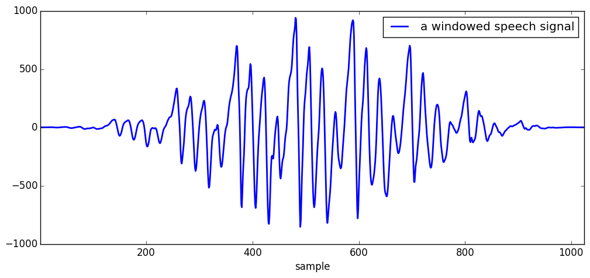
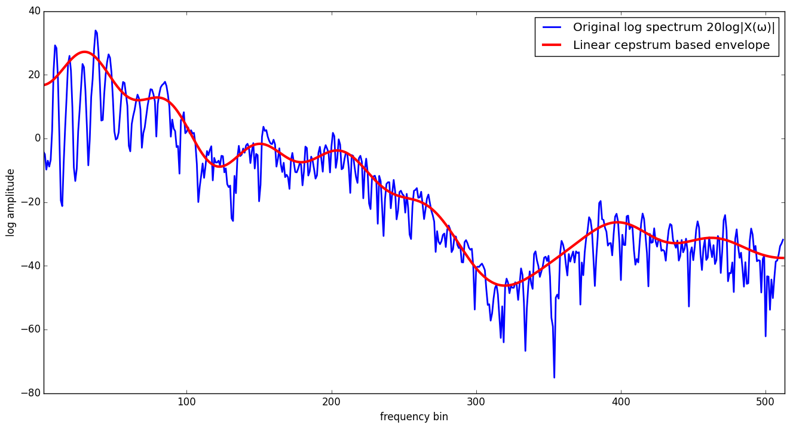
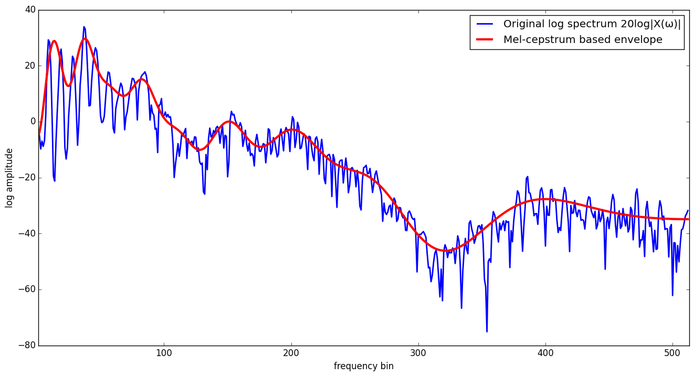
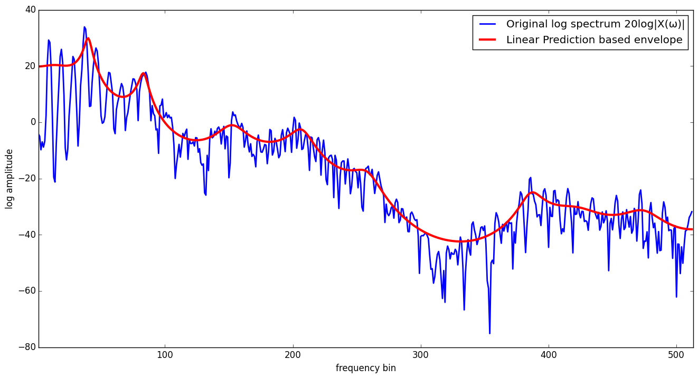
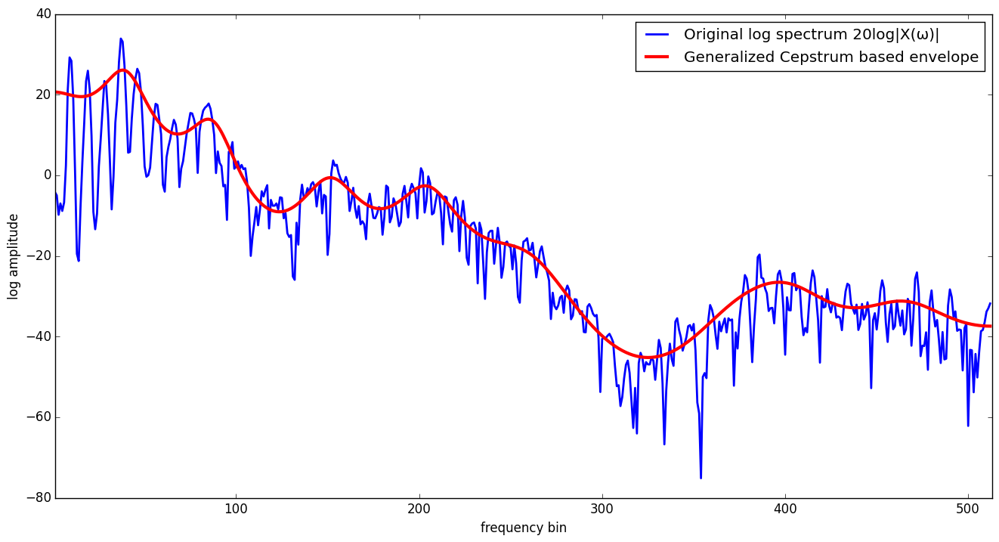
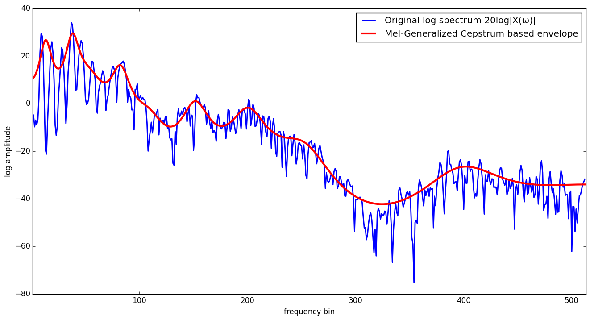

# MelGeneralizedCepstrums

[](https://travis-ci.org/r9y9/MelGeneralizedCepstrums.jl)

MelGeneralizedCepstrums.jl provides a mel generalized-log cepstrum anlysis for spectrum envelope estimation, which includes Linear Predicition, Mel-Cepstrum analysis and Generalized Cepstrum analysis for Julia. The core is re-writen by pure Julia language based on [Speech Signal Processing Toolkit (SPTK)](http://sp-tk.sourceforge.net/). It works linux, osx and windows.

## Type design

MelGeneralizedCepstrums.jl provides a general type `MelGeneralizedCepstrum{F,L,T,N}` which is a subtype of `AbstractArray{T,N}`, where `F` represents a type of frequency scale and `L` represents a type of log function. Linear Prediction-based cepstrum, mel-cepstrum, generalized cepstrum and other kind of cepstrum are represented as a special type with specific type parameters of `MelGeneralizedCepstrum{F,L,T,N}`.

The actual type definition is as follows:

```julia
immutable MelGeneralizedCepstrum{F<:Frequency,L<:Log,T<:FloatingPoint,N} <: AbstractMelGeneralizedCepstrumArray{F,L,T,N}
    α::T
    γ::T
    data::Array{T,N}

    function MelGeneralizedCepstrum(α::T, γ::T, data::Array{T,N})
        abs(α) < 1 || error("|α| < 1 is supported")
        (-1 <= γ <= 0) || error("-1 <= γ <= 0 is supported")
        @assert size(data, 1) > 1
        new(α, γ, data)
    end
end
```

where

```julia
abstract Frequency
type Mel <: Frequency
end
type Linear <: Frequency
end

abstract Log
type GeneralizedLog <: Log
end
type StandardLog <: Log
end
type AllPoleLog <: Log
end
```

Following the above definition, for example, mel-cepstrum is represented as

```julia
typealias MelCepstrum{T,N} MelGeneralizedCepstrum{Mel,StandardLog,T,N}
```

and generalized cepstrum is represented as:

```julia
typealias GeneralizedCepstrum{T,N} MelGeneralizedCepstrum{Linear,GeneralizedLog,T,N}
```

For more information about types, please check [src/common.jl](src/common.jl).

## Mel-generalized cepstrum estimation

This package provides you two ways to estimate (mel-generalized) cepstrum from a speech signal:

- `mcep` - Mel-cepstrum analysis
- `mgcep` - Mel-generalized cesptrum analysis

`mgcep` is more general than mcep but 2~5x slower than `mcep`. You can choose one of them for your need.

A basic API of `mcep` is

```julia
function mcep{T<:FloatingPoint,N}(x::AbstractArray{T,N},
                                  order::Int=40,
                                  α::FloatingPoint=0.41;
                                  kargs...)
    ...
end
```

where `x` is a input windowed signal, `order` is order of cepstrum and `α` is a frequency warping parameter. When `α = 0`, mel-cepstrum analysis corresponds to unbiased cepstrum analysis.

A basic API of `mgcep` is

```julia
function mgcep{T<:FloatingPoint,N}(x::AbstractArray{T,N},
                                   order::Int=40,
                                   α::FloatingPoint=0.41,
                                   γ::FloatingPoint=0.0;
                                   kargs...)
    ...
end
```

where `x` is a input windowed signal, `order` is order of cepstrum, `α` is a frequency warping parameter and `γ` is a paramter of generalized log function. When `γ = 0`, mel-generalized cepstrum analysis corresponds to mel-cepstrum analysis. For more information about mel-generalized cepstrum, please see [the paper](http://www.sp.nitech.ac.jp/~tokuda/selected_pub/pdf/conference/tokuda_icslp1994.pdf).

## How spectrum envelope estimation works

We show how the spectrum envelope estimation works. Suppose that we have a *windowed* speech signal `x` and we want to extact spectral enelope from that.



### Linear Cepstrum

```julia
c = mcep(x, 20, 0.0)
logH = mgc2sp(c, 1024)
logspec = 20.0/log(10)*logH # 20log10(|H(ω)|)  = 20/log(10)*log(|H(ω)|)
```



### Mel-Cepstrum

```julia
mc = mcep(x, 20, 0.41)
logH = mgc2sp(mc, 1024)
logspec = 20.0/log(10)*logH
```



### Linear Prediction

```julia
mgc = mgcep(x, 20, 0.0, -1.0)
logH = mgc2sp(mgc, 1024)
logspec = 20.0/log(10)*logH
```



### Warped Linear Prediction

```julia
mgc = mgcep(x, 20, 0.41, -1.0)
logH = mgc2sp(mgc, 1024)
logspec = 20.0/log(10)*logH
```


### Generalized Cepstrum

```julia
mgc = mgcep(x, 20, 0.0, -0.35)
logH = mgc2sp(mgc, 1024)
logspec = 20.0/log(10)*logH
```



### Mel-Generalized Cepstrum

```julia
mgc = mgcep(x, 20, 0.41, -0.35)
logH = mgc2sp(mgc, 1024)
logspec = 20.0/log(10)*logH
```



For the complete code of visualizations shown above, please check [the ijulia notebook](http://nbviewer.ipython.org/github/r9y9/MelGeneralizedCepstrums.jl/blob/master/examples/MelGeneralizedCepstrumsBasedEnvelope.ipynb).
