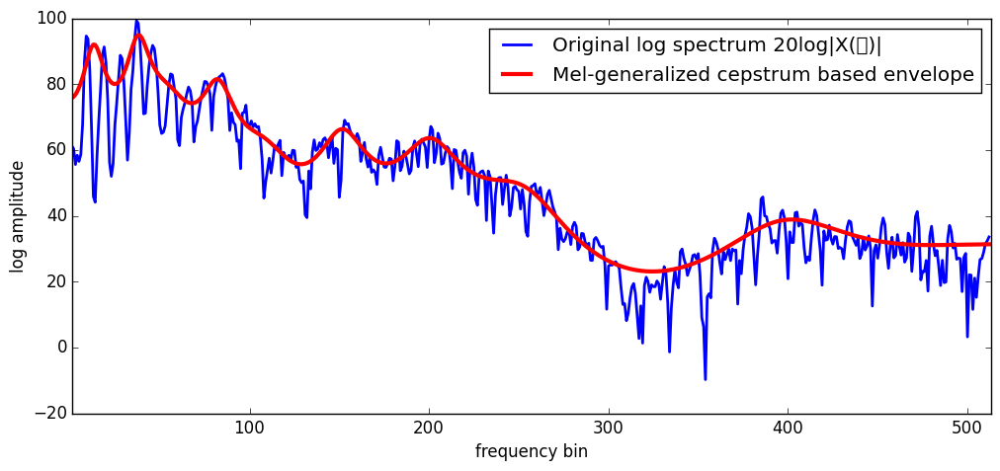

# MelGeneralizedCepstrums

[](https://travis-ci.org/r9y9/MelGeneralizedCepstrums.jl)
[](https://ci.appveyor.com/project/r9y9/melgeneralizedcepstrums-jl/branch/master)
[](https://coveralls.io/r/r9y9/MelGeneralizedCepstrums.jl?branch=master)
[](LICENSE.md)



MelGeneralizedCepstrums.jl provides a mel generalized cepstrum anlysis for spectral envelope estimation that includes:

- linear predicition analysis (LPC)
- generalized cepstrum analysis
- mel-cepstrum analysis
- mel-generalized cepstrum analysis

The package also provides conversions, e.g, mel-generalized cepstrum to mel-cepstrum, mel-cepstrum to (linear frequency) cepstrum, mel-cesptrum to filter coefficients, and vise versa.

Note that this package is built on top of [SPTK.jl](https://github.com/r9y9/SPTK.jl). The package is designed to provide a Julia-like interface with a focus on the mel-generalized cepstrum analysis. A part of the core is re-writen in Julia from [Speech Signal Processing Toolkit (SPTK)](http://sp-tk.sourceforge.net/).

## Demonstration notebook

- [Introduction notebook](http://nbviewer.ipython.org/github/r9y9/MelGeneralizedCepstrums.jl/blob/master/examples/Introduction%20to%20MelGeneralizedCeptrums.jl.ipynb): a brief introduction that shows how the mel-generalized cepstrum analysis works.

## Supported Platforms

- Linux
- Mac OS X
- Windows

## Installation

```julia
Pkg.add("MelGeneralizedCepstrums")
```
